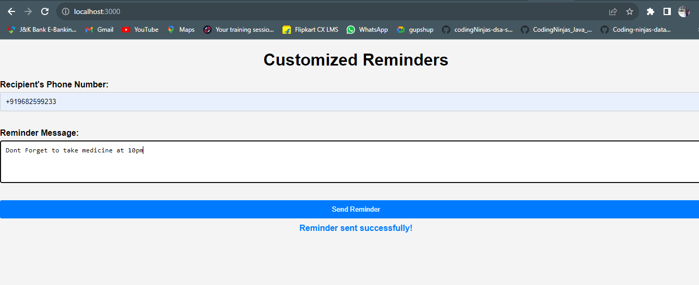

## This is prototype for sending reminder to take the medicine according to time.

## To run this prototype you need
1. Use npm install to add all the dependencies.
2. Use npm start to run the app.
3. Then you need to navigate to postman and fill the required form as shown below using this url http://localhost:3000

5. This will send a reminder to their number so they can take their medicine.
6. This prototype can be used for different purpose not for only medicine it can be used for send them reminders or asking them to visit a doctor's checkup.
7. This prototype has been created using nodeJS.